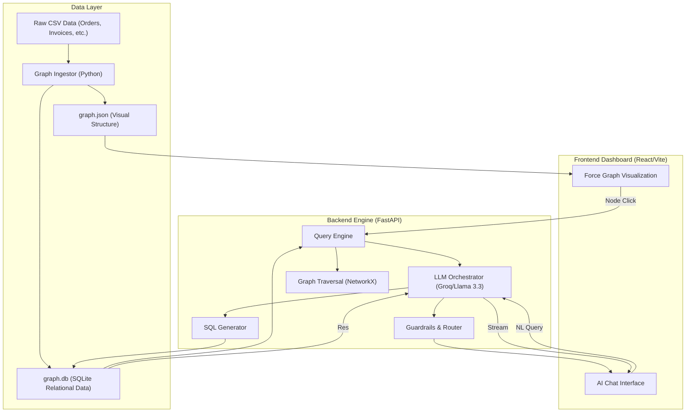

# 🧠 Context Graph System — SAP Order-to-Cash (O2C)

A high-fidelity, interactive platform for exploring SAP business data through **Graph Visualization** and a **Context-Aware Conversational AI**. This system transforms complex relational O2C data into an intuitive knowledge graph, allowing users to query business flows using natural language.

---

## 🏗️ System Architecture

The following diagram illustrates the data flow from raw ERP ingestion to the interactive AI-powered frontend:



---

## 🔄 Detailed Workflow

### 1. **Data Ingestion & Graph Construction**
- **Relational Mapping**: Raw CSV tables (Customers, Orders, Deliveries, Invoices, Payments) are parsed and normalized.
- **Node/Edge Generation**: 
    - **Nodes**: Entities like `Order:SO-1001` or `Invoice:INV-2001`.
    - **Edges**: Relationships such as `PLACED_BY`, `BILLED_AS`, and `SETTLED_BY`.
- **Dual Persistent Storage**: 
    - `graph.json` stores the adjacency list for rapid frontend rendering.
    - `graph.db` (SQLite) stores indexed properties for complex SQL-based analytics.

### 2. **AI Query Processing (NL → SQL/Graph)**
- **Step A: Intent Classification**: The LLM determines if a query is a "Global Aggregate" (SQL-heavy) or a "Relationship Trace" (Graph-heavy).
- **Step B: Safe Code Generation**: The LLM generates a read-only SQLite query or a NetworkX traversal path.
- **Step C: Data Grounding**: Results from the database are fed back into the LLM context to ensure "zero-hallucination" answers.

### 3. **Visualization & Interaction**
- **Force Simulation**: The frontend uses a D3-based force-directed layout to organize 1,500+ entities.
- **Dynamic Neighbor Loading**: Clicking a node triggers a backend request to fetch and render its immediate neighbors, preventing browser lag on massive datasets.

---

## ⚙️ Technical Implementation Details

### **LLM Orchestration**
- **Model**: Llama-3.3-70b-versatile via Groq (chosen for lightning-fast inference).
- **Few-Shot Prompting**: We inject pre-defined pairs of (Natural Language Question → Correct SQL Query) into the system prompt to guide the LLM's logic.
- **Streaming SSE**: The backend uses Server-Sent Events to stream tokens to the frontend, providing a high-quality "thinking" experience for the user.

### **Guardrails & Security**
- **Topic Enforcement**: A pre-flight intent check blocks unrelated questions.
- **Read-Only Validator**: All generated SQL strings are parsed to ensure they do not contain destructive keywords (`DROP`, `DELETE`, etc.).
- **Context Resolution**: The system maintains 10-turns of conversation history specifically to resolve entity pronouns (e.g., "how much did *that* customer pay?").

---

## ✨ Premium Add-ons & Extra Features

- 🔍 **Hybrid Search**: Combines keyword search with semantic embedding-based search for entity discovery.
- 📂 **Clustering & Community Detection**: Automatically groups nodes by business logic (e.g., high-priority customer clusters).
- 🏆 **Centrality Analysis**: Calculates "Degree Centrality" to scale node sizes visually based on their importance in the O2C flow.
- ⚡ **Semantic Deduplication**: Caches LLM results for similar questions, reducing API latency for frequent queries.

---

## 🎥 Project Walkthrough (Quick Start)

1.  **Launch the Dashboard**: Open the [Vercel Deployment URL](https://context-graph-system-six.vercel.app/).
2.  **Explore the Graph**: Zoom and drag the O2C graph. Click an `Order` node to see its linked `Invoice` and `Payment`.
3.  **Ask the AI**:
    -   *"Total order amount for customer 'Amerisource' in 2024?"*
    -   *"Show all unpaid invoices that are older than 30 days."*
    -   *"Trace the full flow for order SO-1234."*
4.  **Verify Results**: Expand the "Data Table" below any AI response to see the ground-truth SQLite records used to generate the answer.

---

## 🛠️ Local Development

### Backend
```bash
cd backend
pip install -r requirements.txt
python main.py
```

### Frontend
```bash
cd frontend
npm install
npm run dev
```
