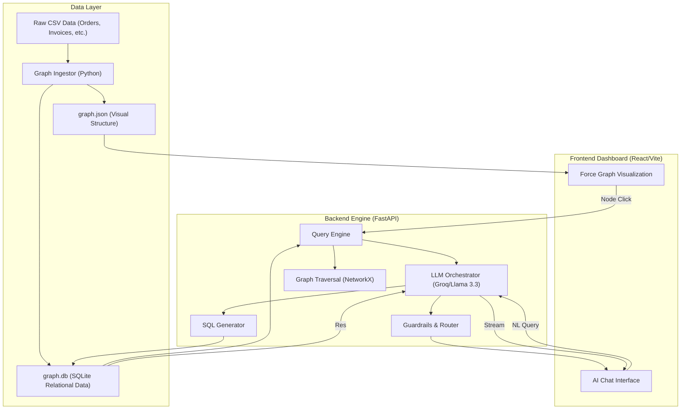
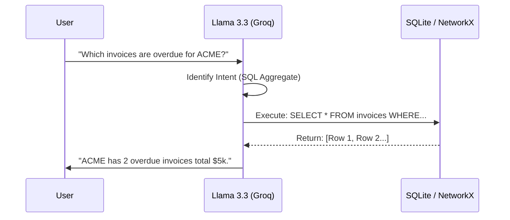

# 🧠 Context Graph System — SAP Order-to-Cash (O2C)

A high-fidelity, interactive platform for exploring SAP business data through **Graph Visualization** and a **Context-Aware Conversational AI**. This system transforms complex relational O2C data into an intuitive knowledge graph, allowing users to query business flows using natural language.

---

## 🏗️ System Architecture

The following diagram illustrates the data flow from raw ERP ingestion to the interactive AI-powered frontend:



---

## 🔍 Deep Dive: Step-by-Step Implementation

### 1. Data Modeling & Graph Transformation
**Logic**: How we turn flat files into a rich web of relationships.

| Action | Implementation | Why? |
|---|---|---|
| **Entity Extraction** | Parsed `customers.csv`, `orders.csv`, and `invoices.csv` into unique Nodes. | Ensures every business object has a unique identity and URI. |
| **Edge Linking** | Mapped Foreign Keys (e.g., `order_id` in `invoices.csv`) to Graph Edges. | Reconstructs the business "flow" that is often hidden in tabular views. |
| **Graph Normalization** | Standardized IDs and filled missing relational links. | Prevents isolated "orphan" nodes and ensures a traversable graph. |

**The "Why":** Standard ERP systems hide the "Order-to-Cash" journey across dozens of tables. By transforming this into a graph, we enable **multi-hop tracing** (e.g., "Find the payment for the third delivery of this order") which is computationally expensive in SQL but trivial in a graph.

---

### 2. Hybrid Query Engine (NL → SQL + Graph)
**Logic**: Translating human language into precise machine queries.



**Implementation Logic:**
- **Intent Router**: The backend uses Llama-3 to classify if the question is "Analytical" (needs SQL) or "Structural" (needs Graph Traversal).
- **Schema Pinning**: We inject the full database schema into the LLM system prompt. This ensures the AI never guesses column names; it only uses what is physically present in `graph.db`.
- **Validation**: Generated SQL is checked against a "Read-Only" whitelist before execution to prevent malicious injections.

---

### 3. Real-time Streaming & Dashboard Execution
**Logic**: Providing a premium, responsive user experience.

- **SSE (Server-Sent Events)**: Instead of a spinning loader, we stream tokens word-by-word.
    - *Implementation*: Uses FastAPI's `StreamingResponse` with an async generator.
    - *Why*: Large LLM responses (70B model) can take 2-3 seconds. Streaming makes the system feel "alive" and interactive immediately.
- **Node Expansion Logic**:
    - *Implementation*: When a node is clicked, the frontend calls `/api/neighbors/{id}`. The backend queries the graph and returns only the 1-hop connections. 
    - *Why*: Loading 10,000+ nodes at once crashes browsers. Dynamic loading keeps the UI fluid while allowing unlimited exploration.

---

### 4. Advanced Guardrails & Topic Control
**Logic**: Keeping the AI focused and safe.

- **Domain Classifier**: A first-pass prompt checks if the query is about SAP/O2C. If the user asks about something else, the system responds: *"I am an SAP data specialist and cannot assist with that topic."*
- **Grounding**: The final answer is **grounded** in the SQL result. If the SQL returns 0 rows, the AI is forbidden from making up an answer.

---

## ✨ Premium Add-ons & Extra Features

- 🔍 **Hybrid Search**: Combines keyword search with semantic embedding-based search for entity discovery.
- 📂 **Clustering & Community Detection**: Automatically groups nodes by business logic (e.g., high-priority customer clusters).
- 🏆 **Centrality Analysis**: Calculates "Degree Centrality" to scale node sizes visually based on their importance in the O2C flow.
- ⚡ **Semantic Deduplication**: Caches LLM results for similar questions, reducing API latency for frequent queries.

---

## 🎥 Project Walkthrough (Quick Start)

1.  **Launch the Dashboard**: Open the [Vercel Deployment URL](https://context-graph-system-six.vercel.app/).
2.  **Explore the Graph**: Zoom and drag the O2C graph. Click an `Order` node to see its linked `Invoice` and `Payment`.
3.  **Ask the AI**:
    -   *"Total order amount for customer 'Amerisource' in 2024?"*
    -   *"Show all unpaid invoices that are older than 30 days."*
    -   *"Trace the full flow for order SO-1234."*
4.  **Verify Results**: Expand the "Data Table" below any AI response to see the ground-truth SQLite records used to generate the answer.

---

## 🛠️ Local Development

### Backend
```bash
cd backend
pip install -r requirements.txt
python main.py
```

### Frontend
```bash
cd frontend
npm install
npm run dev
```
